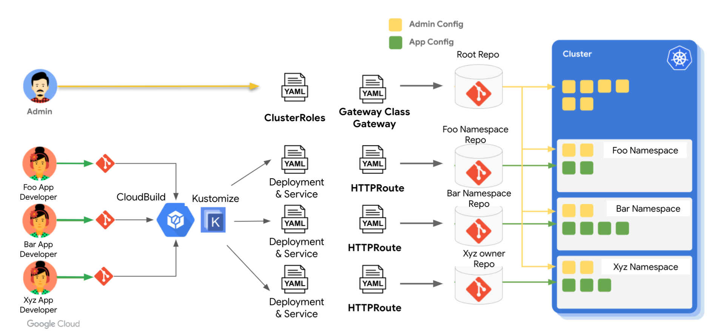

# k8s-gateway-demo

Demo code to show how the persona based Kubernetes Gateway API can be used with Multi repo Config Sync with GKE. This repo is be used for the SpringOne talk https://springone.io/2021/sessions/introducing-kubernetes-gateway-api


# Kubernetes Gateway API Demo using GitOps

Demo code to show how the persona based Kubernetes Gateway API can be used with Multi repo Config Sync with GKE. This repo is be used for the SpringOne talk https://springone.io/2021/sessions/introducing-kubernetes-gateway-api


## Prerequisites
- CloudBuild
- A GKE Cluster
- Ability to create repos on Github 

## Fork and then this repo 
You will need this repo to change the app code, but also, more importantly, you will need to make change to the Docker registry used in the [Cloud Build yaml](cloudbuild.yaml) and the [config-ci-cd/base/foo/deployment/gateway-api-demo-app.yaml](config-ci-cd/base/foo/deployment/gateway-api-demo-app.yaml).
```
git clone https://github.com/[your-github-username]/k8s-gateway-demo.git
```

## Create Config Sync GitHub repos
- Cluster Admin repo (a.k.a Root repo) - Fork the repo https://github.com/abhinavrau/sp1-config-sync-root
- App Owner repo used by Developers - For the repo https://github.com/abhinavrau/sp1-config-sync-app-owner
  
## Create DockerHub and GitHub secrets
- Create secrets called `docker-username` and `docker-password` in Secret Manager
- From GitHub developer setting create a [GitHub personal access token](https://docs.github.com/en/github/authenticating-to-github/keeping-your-account-and-data-secure/creating-a-personal-access-token). Then create secrets called `github-username`, `github-token`  and `github-email` in Secret Manager. 

## Build the apps and push to DockerHub
You need create [Cloud Build trigger](https://cloud.google.com/build/docs/automating-builds/create-manage-triggers). 
You can test the flow by making a simple change to README and doing git push.
**Please note** the Cloud Build yaml is currently designed for Day2. We will add the Cloud Build for Day1 as well very soon. 

## Get GKE credentails for your cluster
```
gcloud container clusters get-credentials [your-gke-cluster-name] --zone=[your-gke-zone]
```

## Install the Istio implementation of Gateway API

Install the Istio Kubernetes Gateway API CRDs and Istio by following the directions here: https://istio.io/latest/docs/tasks/traffic-management/ingress/gateway-api/
```
kubectl kustomize "github.com/kubernetes-sigs/gateway-api/config/crd?ref=v0.3.0" | kubectl apply -f -
curl -sL https://istio.io/downloadIstioctl | sh -
export PATH=$PATH:$HOME/.istioctl/bin
istioctl install

# confirm install is successful 
kubectl get ns
```

## Install ConfigSync operator on the Cluster

```
gsutil cp gs://config-management-release/released/latest/config-management-operator.yaml config-management-operator.yaml

kubectl apply -f config-management-operator.yaml

#confirm install is successful
kubectl get ns
```
## Create SSH keys so Configs Sync can access the GitHUb repos

Create SSH key and use it for the config sync root repo. 
```
ssh-keygen -t rsa -b 4096 \
-C "GIT_REPOSITORY_USERNAME" \
-N '' \
-f /path/to/KEYPAIR_FILENAME
```
Add the private keys to a new Secret in the cluster:
```
kubectl create secret generic git-creds \
 --namespace=config-management-system \
 --from-file=ssh=/path/to/KEYPAIR_PRIVATE_KEY_FILENAME
 ```
## Create Config Management resource
In this demo we are using Multi-repo option. In this scenario the Root repo will be Hierarchial and the App repo (which is also called as Namespace Repo) will be Unstructured. The purpose of the Root Repo is to create cluster wide resources across all the clusters that participate in *this* config sync repo. This is intended to have a consistent operating model across fleet of clusters without having to write bespoke scripts, or worse, imperative commands manually. The App repo (or Namespace repo) is dedicated for a particular Namespace which is essentially used for deploying apps. So from a separation of responsibility point of view the **Root Sync Repo is a concern of Cluster Administrator, and App Repo (or Namespace repo) is a concern of the App Owner**. 
It is important to note that the Root Sync Repo creates all the Namespaces requried to deploy the apps. Please take a look at [sp1-config-sync-root](https://github.com/abhinavrau/sp1-config-sync-root). This is a typical Root Sync Repo with Hierarchial structure. It has three main folders - 
- [sytem](https://github.com/abhinavrau/sp1-config-sync-root/tree/main/system) - this has a [repo.yaml](https://github.com/abhinavrau/sp1-config-sync-root/blob/main/system/repo.yaml) used by config management to recognize this as a config repo. 
- [cluster](https://github.com/abhinavrau/sp1-config-sync-root/tree/main/cluster)  - used for cluster wide resources. In our demo we are going to install the Istio GatewayClass so that we can use the new Gateway API for our apps. The Gateway API requires a custom resource to define HTTP Routes. This resource will be created by App Owners within the App Repo (or Namespace Repo). In the App Repo the ACM will require (rather, the ServiceAccount we intend to use for ACM in the App Repo requires) permissions to create resources including the custom resource HTTP Route.  The out-of-box **Admin** ClusterRole doesn't give permissions to create custom resoures. So we need to define a new ClusterRole with permissions to create HTTPRoute. We will later user this ClusterRole in a RoleBinding in App namespace to grant the ServiceAccount the necessary permissions to allow creating HTTPRoute. Take a look at [app-and-http-route-manager](https://github.com/abhinavrau/sp1-config-sync-root/blob/main/cluster/custom-http-route-role.yaml). 
- [namespaces](https://github.com/abhinavrau/sp1-config-sync-root/tree/main/namespaces) - used for namespace scoped resources. Each namespace is represented by a folder by the name of the Namespace. At the minimum each folder contains the [namespace  definition](https://github.com/abhinavrau/sp1-config-sync-root/blob/main/namespaces/foo/namespace.yaml) itself. There are two models - one with all the Namespace custom resources defined right here. For example, [istio-system](https://github.com/abhinavrau/sp1-config-sync-root/tree/main/namespaces/istio-system). In this case we are creating an [instance of Gateway](https://github.com/abhinavrau/sp1-config-sync-root/blob/main/namespaces/istio-system/external-gateway.yaml) which will be created across all the clusters in istio-namespace. The other model is to create a Namespace with its own repo sync. For example, [foo](https://github.com/abhinavrau/sp1-config-sync-root/tree/main/namespaces/foo). This is our Namespace for deploying app and the app specific resources. In this Namespace the resources defined in this folder are created by the Cluster Administrator. In our case we have two Role Binding defintions. Take a look at [sync-rolebinding-2.yaml](https://github.com/abhinavrau/sp1-config-sync-root/blob/main/namespaces/foo/sync-rolebinding-2.yaml) and [sync-rolebinding.yaml](https://github.com/abhinavrau/sp1-config-sync-root/blob/main/namespaces/foo/sync-rolebinding.yaml). This is also a classic example of Multi-repo scenario where Cluster Administrator allows App Owner to use a separate App specific GIT repo for resources required for app namespace. Such as the deployment, services and in the case, HTTP Route resources. The definition of app repo is in [RootSync](https://github.com/abhinavrau/sp1-config-sync-root/blob/main/namespaces/foo/repo-sync.yaml). As you can see in this example, the RootSync contains the GIT URL and the secret we had created earlier. Since the SSH key for GitRepo is a sensitive reource we didn't include the definition of the secret in the config repo. 

### Create the Config Sync resources
1. Create [ConfigManagement](https://github.com/abhinavrau/k8s-gateway-demo/blob/main/config-sync/config-management.yaml) resource and set it to use multi-repo 
```
kubectl apply -f config-sync/config-management.yaml
``` 
2. Set the [root-sync](https://github.com/abhinavrau/k8s-gateway-demo/blob/main/config-sync/root-sync.yaml) repo for the clusters. **Please note** you must ensure the secret used by root-sync is created. 
```
kubectl get secret git-creds -n config-management-system
```
If the secret doesn't showup then please create the secret as guided in the doc earlier. 
```
kubectl apply -f config-sync/root-sync.yaml
```
**Please note** 
The secret for RepoSync needs to be created manually. In future we will consider using GCP Secret Manager. 

1. Create a secret for App Owner repo in the foo namespace. Create SSH key and use it for the config RepoSync. 
```
ssh-keygen -t rsa -b 4096 \
-C "GIT_REPOSITORY_USERNAME" \
-N '' \
-f /path/to/KEYPAIR_FILENAME
```
Add the private keys to a new Secret in the cluster:
```
kubectl create secret generic foo-git-creds \
 --namespace=foo \
 --from-file=ssh=/path/to/KEYPAIR_PRIVATE_KEY_FILENAME
 ```
 Register the Public keys with GitHub. GitHub public key will get access to all your Git repos.

 ## 

### Steps to perfom on a new Cluster
- Install istio gateway CRD 
- Install istio 
- Setup ACM operator 
- kubectl apply -f config-sync/config-management.yaml -f root-sync.yaml
- Create secret for SSH private key of the GIT repos in cluster

  